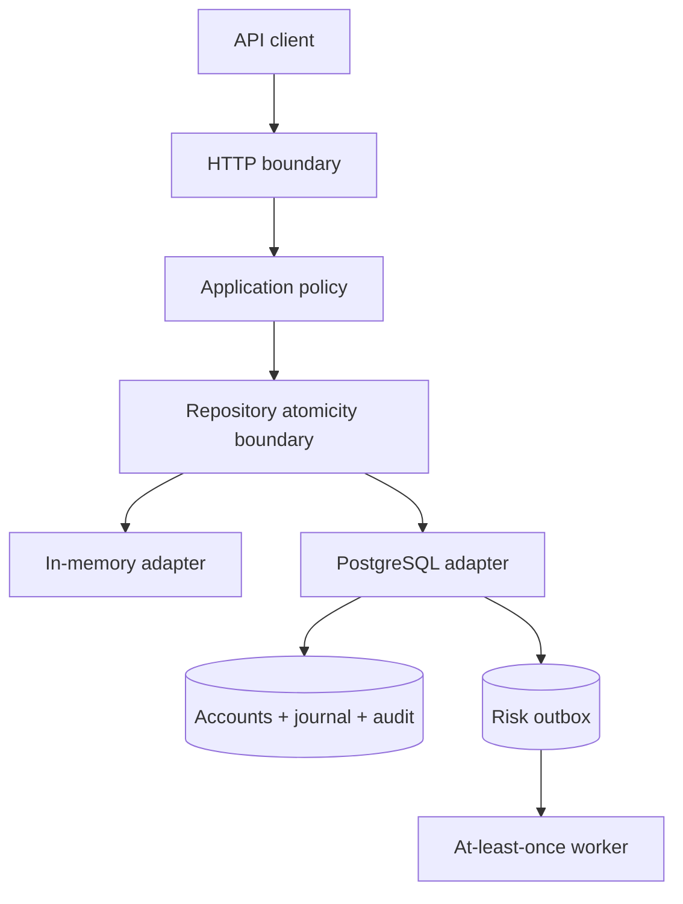

# SecureLedger

[](https://github.com/VolodymyrStetsenko/SecureLedger/actions/workflows/ci.yml)
[](https://github.com/VolodymyrStetsenko/SecureLedger/actions/workflows/codeql.yml)
[](LICENSE)

SecureLedger is a Go reference service for accountable money movement. It
implements a balanced double-entry journal, atomic transfers, durable
PostgreSQL persistence, actor-scoped idempotency, ownership-aware
authorisation, audit evidence, risk-event delivery and ledger reconciliation.

The repository is deliberately explicit about its security boundary. It is a
working financial-ledger reference implementation, not a licensed bank, a
payment processor, or certified software for holding real customer funds.

## Engineering goals

The design concentrates on failure modes that are easy to miss in an ordinary
CRUD service:

- a transfer must debit and credit in one atomic commit;
- concurrent requests must not spend the same balance twice;
- an ambiguous client retry must not create another transfer;
- every journal transaction must contain exactly its expected postings and sum
  to zero;
- account balances must be reconcilable from immutable posting history;
- audit and risk records must be committed with the financial state they
  describe;
- an account identifier must never be treated as proof of ownership.

## Implemented capabilities

| Area | Implementation |
|---|---|
| Money model | Signed `int64` minor units; no floating-point arithmetic |
| Accounting | Two-posting transfers and opening entries offset by internal equity accounts |
| Atomicity | One repository operation for balances, postings, audit record and optional risk event |
| PostgreSQL | `SERIALIZABLE` transactions, deterministic row locks and bounded retry for serialization/deadlock failures |
| Concurrency | Overspend protection in both mutex-backed memory and PostgreSQL adapters |
| Idempotency | Mandatory 8–128 character key, scoped by actor and bound to an immutable SHA-256 request fingerprint |
| Authorisation | Customer ownership checks plus operator, administrator and auditor policies |
| Auditability | Append-only audit rows and immutable journal history enforced by database triggers |
| Risk delivery | Transactional PostgreSQL outbox, leased batch claims, retry backoff and at-least-once publication |
| Reconciliation | Read-only repeatable snapshot comparing stored balances with all postings |
| HTTP boundary | Strict JSON, 1 MiB body limit, stable domain errors, security headers and server timeouts |
| Delivery | OpenAPI 3.1, non-root distroless image, Docker Compose, CI, CodeQL and Dependabot |

## Architecture



The in-memory adapter is useful for fast local execution and deterministic unit
tests. The PostgreSQL adapter is the durable path and is the subject of
integration and concurrency tests. See [Architecture](docs/architecture.md),
[PostgreSQL design](docs/postgresql-design.md) and the
[ADRs](docs/adr/).

## Quick start

### Complete PostgreSQL-backed stack

Requirements: Docker Engine with the Compose plugin, `curl` and `jq`.

```bash
git clone https://github.com/VolodymyrStetsenko/SecureLedger.git
cd SecureLedger
make compose-up
curl --fail http://localhost:8080/readyz
./scripts/demo.sh
```

`make compose-up` starts PostgreSQL 17, applies the initial schema on a new
database volume, builds the non-root application image and waits for readiness.
Both ports bind to `127.0.0.1` only.

Stop the stack without deleting ledger data:

```bash
make compose-down
```

### Fast in-memory mode

Requirements: Go 1.26 or later.

```bash
make test
make run
```

State in this mode exists only for the lifetime of the process. The API listens
on `http://localhost:8080` unless `SECURELEDGER_ADDR` is changed.

## API walkthrough

Identity headers in these examples are a development boundary, not real
authentication. Do not expose this configuration to an untrusted network.

Create the funded source account:

```bash
curl --fail-with-body -sS -X POST http://localhost:8080/v1/accounts \
  -H 'Content-Type: application/json' \
  -H 'X-Principal-ID: operator-1' \
  -H 'X-Principal-Role: operator' \
  --data '{"owner_id":"alice","currency":"GBP","opening_balance_minor":10000}'
```

Create a zero-balance destination account in the same way with `bob` as the
owner. Then use the returned account IDs:

```bash
curl --fail-with-body -sS -X POST http://localhost:8080/v1/transfers \
  -H 'Content-Type: application/json' \
  -H 'X-Principal-ID: alice' \
  -H 'X-Principal-Role: customer' \
  -H 'Idempotency-Key: transfer-2026-0001' \
  --data '{
    "from_account_id":"SOURCE_ACCOUNT_ID",
    "to_account_id":"DESTINATION_ACCOUNT_ID",
    "amount_minor":2500,
    "description":"Invoice 2026-0001"
  }'
```

The first successful request returns `201 Created`. Repeating the exact request
with the same actor and key returns `200 OK`, the original transfer and
`Idempotent-Replayed: true`; it does not add postings or move funds again.
Reusing the key with different transfer fields returns `409 Conflict`.

The complete contract, including every response schema, is in
[api/openapi.yaml](api/openapi.yaml).

## Core invariants

1. Monetary inputs are positive integers in minor currency units.
2. Each committed journal transaction has exactly its declared number of
   postings.
3. The signed sum of those postings is zero.
4. A non-system account cannot have a negative balance.
5. A transfer cannot cross currencies or target its own source account.
6. The source debit, destination credit, postings, audit record and risk event
   either commit together or do not commit.
7. An `(actor_id, idempotency_key)` pair identifies one immutable transfer
   intent.
8. Customer access to an account depends on ownership, not knowledge of its ID.
9. Materialised balances equal the sum of all postings for each account.

The same repository contract is exercised against both adapters. PostgreSQL
adds deferred balance constraints, append-only triggers, unique idempotency
constraints and real concurrent transaction tests.

## Repository map

```text
api/                         OpenAPI 3.1 contract
cmd/secureledger/            HTTP service executable
cmd/secureledger-reconcile/  PostgreSQL integrity-check executable
deploy/postgres/             Ordered database migration
docs/                        Architecture, operations, security and decisions
internal/app/                Use cases, validation and authorisation policy
internal/domain/             Financial types and accounting invariants
internal/httpapi/            HTTP parsing, error mapping and middleware
internal/risk/               Process-local dispatcher and durable outbox worker
internal/store/              Atomic repository contract
internal/store/memory/       Concurrency-safe volatile adapter
internal/store/postgres/     Durable transactional adapter and reconciliation
scripts/                     Reproducible demo and schema verification
```

## Development commands

Run `make help` for the authoritative list. The main quality gates are:

```bash
make check                 # format, vet, race-enabled tests and builds
make test-integration      # PostgreSQL adapter tests under the race detector
make coverage              # local coverage report
make reconcile-postgres    # compare balances with posting history
```

CI runs on every pull request and on `main`. It validates formatting, static
analysis, known Go vulnerabilities, race-enabled tests, coverage floors, the
OpenAPI contract, binaries and container build, PostgreSQL constraints and
concurrent overspend behaviour. CodeQL runs separately with least-privilege
workflow permissions.

Detailed procedures are in [Getting started](docs/getting-started.md),
[Testing](docs/testing.md) and [Operations](docs/operations.md).

## Configuration

| Variable | Default | Purpose |
|---|---:|---|
| `SECURELEDGER_ADDR` | `:8080` | HTTP listen address |
| `SECURELEDGER_STORE` | `memory` | `memory`, `postgres` or `postgresql` |
| `SECURELEDGER_DATABASE_URL` | none | PostgreSQL connection URI; required by the durable adapter |
| `SECURELEDGER_MAX_TRANSFER_MINOR` | `100000000` | Maximum accepted amount per transfer |
| `SECURELEDGER_RISK_THRESHOLD_MINOR` | `1000000` | Amount that creates a risk event |
| `SECURELEDGER_LOG_LEVEL` | `info` | `debug`, `info`, `warn` or `error` |

Invalid or non-positive numeric limit values fall back to the documented
defaults. Keep secrets out of committed environment files and logs.

## Security and scope

The current implementation still requires additional controls before any
internet-facing or real-money use:

- replace asserted identity headers with validated OIDC/workload identities;
- terminate TLS at a trusted ingress and add rate limits and abuse controls;
- separate schema-owner, migration and runtime database roles;
- connect the outbox publisher to a durable external broker or risk service;
- define currency exponents instead of assuming generic minor units;
- add backups, restore drills, metrics, tracing and service-level objectives;
- arrange independent security review and any required regulatory assessment.

No external review, regulatory approval, PCI scope assessment or banking
certification is claimed. See [Security assumptions](docs/security-assumptions.md),
[Threat model](docs/threat-model.md) and [SECURITY.md](SECURITY.md).

## Author

Volodymyr Stetsenko

## License

[MIT](LICENSE)
