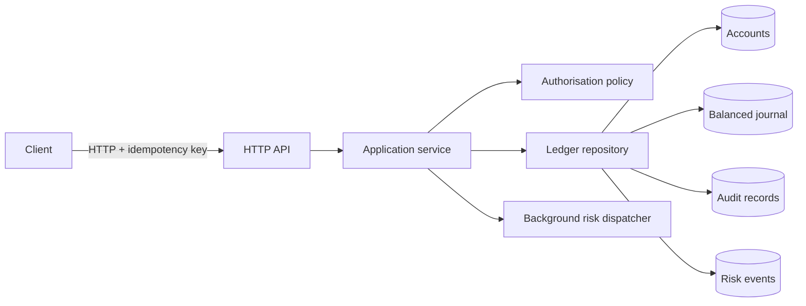

# SecureLedger

**A security-focused financial ledger reference system by Volodymyr Stetsenko.**

SecureLedger is an executable portfolio project that demonstrates how to reason
about money movement, double-entry invariants, idempotency, authorisation,
concurrency, auditability and operational risk in a small Go service.

It is intentionally **not marketed as production banking software**. The goal is
to make important design decisions inspectable, testable and discussable during
engineering or product-security interviews.

## Why this project exists

A strong security portfolio should contain more than vulnerability write-ups.
It should show that the author can:

- define assets and trust boundaries;
- preserve financial invariants under concurrency;
- design safe failure behaviour;
- make replayed requests harmless;
- separate authentication assumptions from authorisation policy;
- produce evidence through tests, audit records and architecture decisions;
- explain what is still missing before production.

## Capabilities

- multi-currency accounts using integer minor units;
- balanced journal transactions: every transaction sums to zero;
- atomic transfers with insufficient-funds protection;
- actor-scoped idempotency keys that prevent duplicate money movement;
- account-owner and operator/admin authorisation rules;
- configurable per-transfer limits;
- append-only audit records;
- risk events for high-value transfers;
- bounded JSON request bodies and strict decoding;
- race-safe in-memory storage;
- background risk-event dispatcher;
- unit, integration, concurrency and HTTP tests;
- complete OpenAPI response schemas, threat model, ADRs and CI configuration;
- executable PostgreSQL target-schema checks for balance and append-only constraints.

## Architecture



See [docs/architecture.md](docs/architecture.md) and
[docs/threat-model.md](docs/threat-model.md).

## Quick start

Requirements: Go 1.26 or later.

```bash
git clone https://github.com/VolodymyrStetsenko/secureledger.git
cd secureledger
make test
make run
```

The API listens on `:8080` by default.

A minimal non-root container image is also included:

```bash
docker build -t secureledger:local .
docker run --rm -p 8080:8080 secureledger:local
```

### Create two accounts

The development identity boundary uses headers. This is deliberately insecure
for internet deployment and is documented in
[docs/security-assumptions.md](docs/security-assumptions.md).

```bash
curl -sS -X POST http://localhost:8080/v1/accounts \
  -H 'Content-Type: application/json' \
  -H 'X-Principal-ID: operator-1' \
  -H 'X-Principal-Role: operator' \
  -d '{"owner_id":"alice","currency":"GBP","opening_balance_minor":10000}'
```

Create a second account for `bob`, copy both returned IDs, then transfer:

```bash
curl -sS -X POST http://localhost:8080/v1/transfers \
  -H 'Content-Type: application/json' \
  -H 'X-Principal-ID: alice' \
  -H 'X-Principal-Role: customer' \
  -H 'Idempotency-Key: demo-transfer-001' \
  -d '{
    "from_account_id":"ACCOUNT_A",
    "to_account_id":"ACCOUNT_B",
    "amount_minor":2500,
    "description":"Demo transfer"
  }'
```

Replaying the exact request with the same idempotency key returns the original
transfer and does not move funds twice. Keys are scoped to the asserted actor, so
two independent actors may use the same client-generated key without colliding.

## Core invariants

1. Amounts are positive integers in minor currency units.
2. Each journal transaction contains at least two postings.
3. The signed sum of postings for a transaction is exactly zero.
4. A normal customer account cannot become negative.
5. Source and destination currencies must match.
6. A given actor and idempotency-key pair maps to one immutable transfer intent.
7. Audit records are appended for security-relevant actions.
8. The API never trusts an account ID alone for authorisation.

The tests in `internal/store/memory` and `internal/app` are the main evidence for
these claims.

## Repository map

```text
api/                    OpenAPI contract
cmd/secureledger/       executable
docs/                   architecture, threat model, ADRs
internal/app/           use cases and policy orchestration
internal/domain/        financial model and validation
internal/httpapi/       HTTP boundary
internal/risk/          asynchronous alert dispatcher
internal/store/         repository contract
internal/store/memory/  race-safe executable adapter
deploy/postgres/        constrained target schema (adapter not implemented)
scripts/                local demo and PostgreSQL schema checks
```

## Validation

```bash
make check
make test-race
make coverage
```

CI repeats formatting, vet, race-enabled tests, coverage collection, build, and
PostgreSQL schema checks. It also enforces a 65% repository-wide coverage floor
and lints the OpenAPI document. The schema test proves that balanced transactions
commit, unbalanced transactions fail at the deferred constraint boundary, and
historical postings reject update/delete operations.

## Honest limitations

- state is lost when the process restarts;
- authentication headers are development-only;
- the audit log is append-only in process, not cryptographically tamper-evident;
- the risk dispatcher is best-effort;
- there is no distributed locking or durable outbox;
- no external security review or compliance certification has been performed.
- `deploy/postgres` is a tested design target; the running service still has no
  PostgreSQL repository adapter.

These are not hidden. They define the next engineering milestones.

## Learning path for the maintainer

Read and explain the project in this order:

1. `internal/domain/model.go`
2. `internal/store/store.go`
3. `internal/store/memory/store.go`
4. `internal/app/service.go`
5. `internal/httpapi/server.go`
6. tests
7. threat model and ADRs

For each file, answer: what invariant does it protect, what could fail, and what
would change with PostgreSQL or multiple service instances?

## Author

**Volodymyr Stetsenko**

Security-focused software engineering, smart-contract security and financial
systems.

## Licence

MIT.
