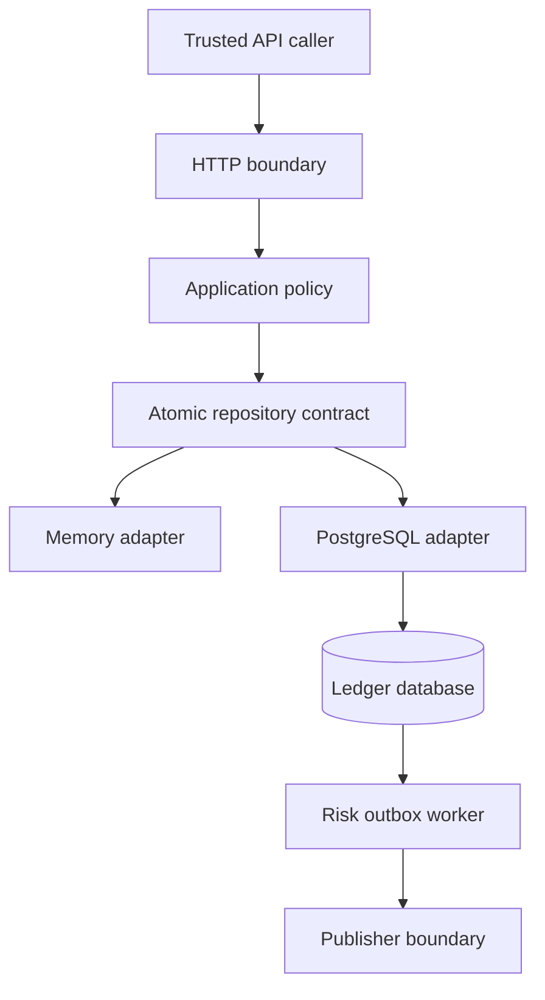
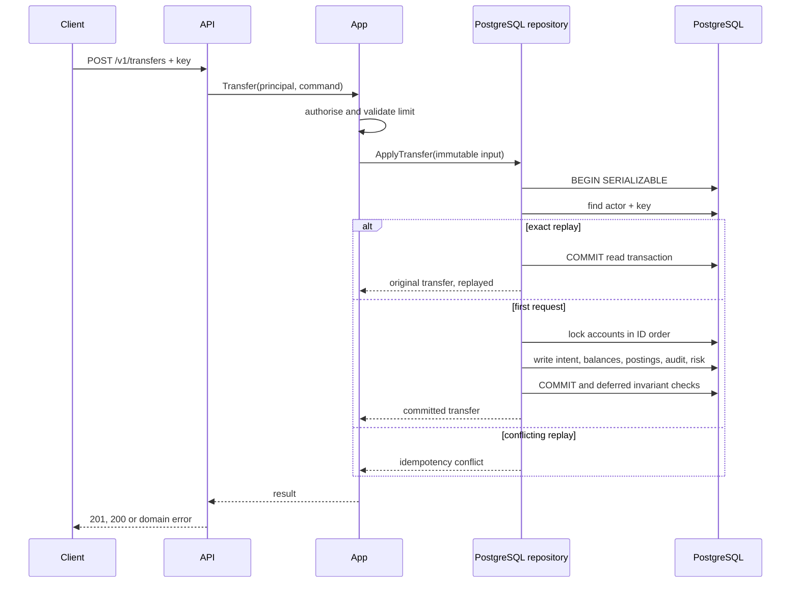

# Architecture

## System context

SecureLedger accepts account and transfer commands over HTTP. The application
layer validates policy, while the selected repository owns the atomic state
transition. The durable path stores materialised balances, immutable journal
postings, audit evidence and risk outbox rows in PostgreSQL.

The caller is trusted only for transport in local development. The
`X-Principal-*` headers are asserted identity attributes and are not a
production authentication mechanism.

## Component responsibilities

### HTTP boundary — `internal/httpapi`

- accepts only the documented routes and methods;
- enforces `application/json`, one JSON object and a 1 MiB body ceiling;
- rejects unknown JSON fields;
- extracts the development principal and idempotency key;
- maps domain errors to stable status codes and public messages;
- adds no-store and browser-hardening response headers;
- logs method, path, response status and duration without request bodies.

It deliberately contains no accounting decisions.

### Application service — `internal/app`

- validates actor roles and customer ownership;
- validates account and transfer commands;
- applies the configured per-transfer ceiling;
- derives currency from the source and destination accounts;
- creates cryptographically random identifiers;
- constructs one immutable repository command;
- requests process-local risk delivery only for the memory adapter.

The service does not split a transfer into separate debit and credit writes.

### Domain — `internal/domain`

The domain package defines principals, accounts, transfer intents, postings,
audit records and risk events. Its central accounting check rejects:

- fewer than two postings;
- zero-valued postings;
- mixed currencies;
- missing identifiers;
- signed integer overflow;
- a non-zero posting sum.

The package has no dependency on HTTP, PostgreSQL or process lifecycle.

### Repository contract — `internal/store`

`ApplyTransfer` is the financial atomicity boundary. It must either commit all
of the following or commit none of them:

1. the transfer identity and idempotency mapping;
2. the source and destination balance changes;
3. both signed journal postings;
4. the audit record;
5. the optional risk event.

The memory adapter implements this with one mutex. The PostgreSQL adapter uses a
serializable transaction, explicit row locks in sorted account-ID order,
database constraints and bounded retry.

### Risk delivery — `internal/risk`

Memory mode uses a bounded process-local dispatcher. PostgreSQL mode does not
notify after commit from the request path; the risk row is already part of the
transfer transaction. A background worker claims committed events with
`FOR UPDATE SKIP LOCKED`, assigns a lease, publishes at least once and records
success or a delayed retry.

The included publisher writes structured event metadata to the application
log. An external broker adapter can implement the same `Publisher` interface.

### Reconciliation — `cmd/secureledger-reconcile`

The reconciliation command opens a repeatable-read, read-only transaction so
every check uses one database snapshot. It verifies:

- every journal transaction still has its expected posting count and zero sum;
- each account's stored balance equals the sum of its complete posting history.

It prints a machine-readable JSON report and exits with an error when a
difference exists.

## Transfer sequence

For a serialization failure, deadlock or concurrent idempotency insert, the
adapter rolls back and retries the complete transaction up to the configured
internal bound. A retry always re-reads balances and idempotency state.

## Consistency model

### Memory adapter

- linearized inside one process by an exclusive mutex;
- safe under Go's race detector;
- no durability or cross-process coordination;
- risk delivery can be lost on shutdown or a full queue.

### PostgreSQL adapter

- transactionally durable according to the database configuration;
- serializable financial writes;
- deterministic pessimistic locks for the two affected accounts;
- unique actor/key idempotency mapping;
- deferred posting-count and zero-sum enforcement at commit;
- at-least-once risk-event delivery from a durable outbox;
- repeatable-read reconciliation snapshot.

An HTTP timeout around commit is inherently ambiguous to the caller. The client
must retry with the same idempotency key. A new key represents a new command.

## Source of truth and derived state

Journal postings are the accounting evidence. `accounts.balance_minor` is a
materialised value maintained in the same transaction for fast reads. The
reconciliation command detects divergence; it does not silently repair it.
Repair requires investigation and an explicit compensating-entry policy rather
than editing historical postings.

## Deployment boundary

The supplied Compose topology is a reproducible local environment, not a
complete production platform. A production deployment needs authenticated
identity, TLS, secrets management, distinct migration/runtime roles, monitored
backups, an external event sink, telemetry, quotas and independent review.
