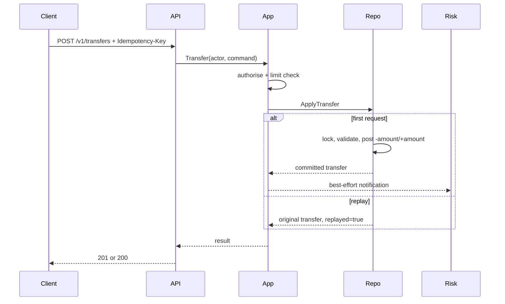

# Architecture

## Context

SecureLedger models an internal money-movement service. It accepts account and
transfer commands, applies policy, writes a balanced journal, updates a
materialised account balance, appends an audit record and emits risk events.

## Components

### HTTP boundary

Responsibilities:

- request-size limit;
- strict JSON decoding;
- development identity extraction;
- mapping domain errors to stable responses;
- security headers.

It does not own financial rules.

### Application service

Responsibilities:

- validate actor permissions;
- enforce configured transfer limits;
- construct immutable command data;
- call the repository once per use case;
- submit post-commit risk notifications.

### Domain

The domain package defines currency, accounts, transfers, postings, audit
records, risk events and validation functions. It contains no HTTP or storage
knowledge.

### Repository

The repository owns the atomicity boundary. A transfer must either:

- validate idempotency and balances;
- update both account balances;
- append both postings;
- append the audit record and optional risk event;

or change nothing.

The in-memory adapter uses a mutex to demonstrate the contract. A production
PostgreSQL adapter should use a serialisable transaction or carefully designed
row locks, unique constraints and retry semantics.

## Data flow

## Consistency model

The executable adapter is single-process and strongly consistent inside its
mutex. It does not claim durability or distributed consistency.

A durable adapter must address:

- uniqueness of actor-scoped idempotency keys;
- account row locking order to avoid deadlocks;
- transaction isolation and retry;
- journal immutability;
- materialised balance reconciliation;
- durable event publication with an outbox;
- migration compatibility.

## Why materialised balances exist

The journal is the source of truth conceptually. Account balances are maintained
as a fast materialised view. Production systems should periodically recompute
balances from journal entries and alert on divergence.
