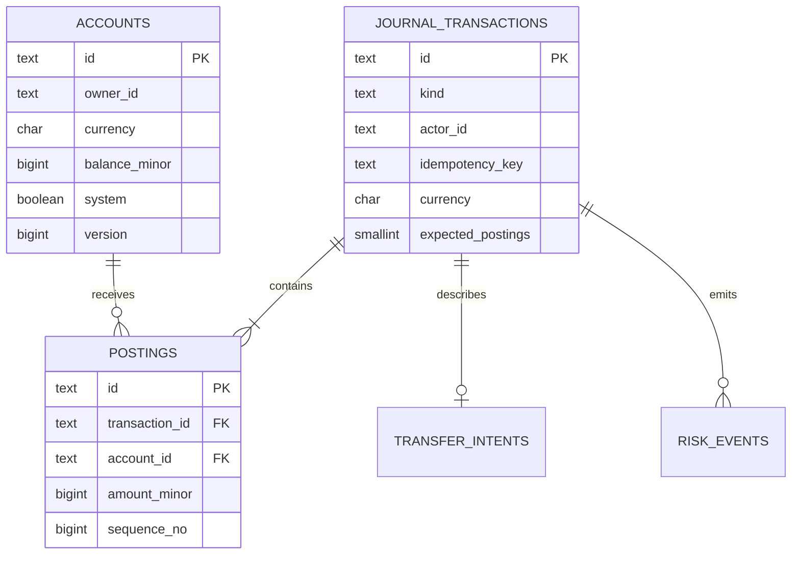
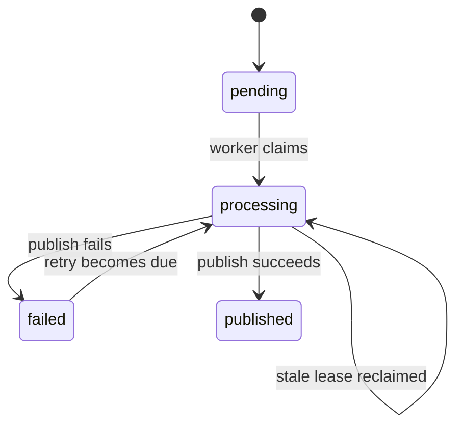

# Data model

## Overview

The model separates financial evidence from fast account reads. Journal
postings explain every non-zero balance; `accounts.balance_minor` is the
materialised value checked by reconciliation.



Audit records reference resources by stable identifier rather than a foreign
key so security evidence can describe several resource types.

## Accounts

An account has one owner, one currency and a materialised balance. Ordinary
accounts cannot be negative. Internal equity accounts use IDs of the form
`system:equity:GBP`, are owned by `system`, and may be negative to offset opening
balances.

`version` increments with each balance change. Serializable transactions and
row locks currently provide write safety; the version remains available for
diagnostics or a future optimistic-concurrency strategy.

PostgreSQL permits transactional updates to balance, version and update time,
but a trigger rejects changes to account ID, owner, currency, system status or
creation time and rejects account deletion.

## Journal transactions

The journal transaction is the grouping boundary for postings. Current kinds
are:

- `opening`: initial account funding, without an idempotency key;
- `transfer`: customer/operator money movement with a mandatory key.

`expected_postings` is two for current operations. A deferred constraint checks
both the count and signed sum at commit, after all rows have been inserted.

## Postings

A posting is a signed amount applied to one account:

- negative for the source side of a transfer;
- positive for the destination side;
- positive for an opening customer balance;
- negative for the matching system-equity side.

Each posting has a monotonically assigned database sequence. Journal reads
return the requested recent window in ascending sequence order. Updates and
deletes are rejected by trigger.

Example transfer of 2,500 minor units:

| Account | Amount |
|---|---:|
| Source | -2,500 |
| Destination | +2,500 |
| Sum | 0 |

## Transfer intents and idempotency

`transfer_intents` contains the source, destination, amount and request
fingerprint. The journal row contains actor, key, currency, description and
creation time. Together they reconstruct the immutable API transfer.

The unique `(actor_id, idempotency_key)` constraint prevents two committed
transfers in the same actor scope. A repeated request must also match the stored
intent field by field. Key equality alone is not enough.

## Audit records

An audit row records actor, action, resource, outcome, structured metadata and
time. Account creation and successful transfer creation are written atomically
with the operation. The table is append-only, but local schema-owner credentials
are still stronger than that trigger; see the security assumptions.

The API does not log raw request bodies, database URIs or idempotency keys.

## Risk events and outbox state

A transfer at or above `SECURELEDGER_RISK_THRESHOLD_MINOR` creates a
`high_value_transfer` event with medium severity. This is a deterministic
demonstration rule, not a real fraud decision.

PostgreSQL delivery state transitions are:



`attempts` increases on every claim. `available_at` schedules retry,
`locked_at` represents the lease, and `last_error` is limited to 500 characters.

## Reconciliation relationship

For every account `a`, the expected invariant is:

```text
a.balance_minor = SUM(postings.amount_minor WHERE postings.account_id = a.id)
```

Zero-balance accounts with no postings satisfy the invariant because the empty
sum is treated as zero. The reconciliation report includes system accounts in
its account count and comparisons.
