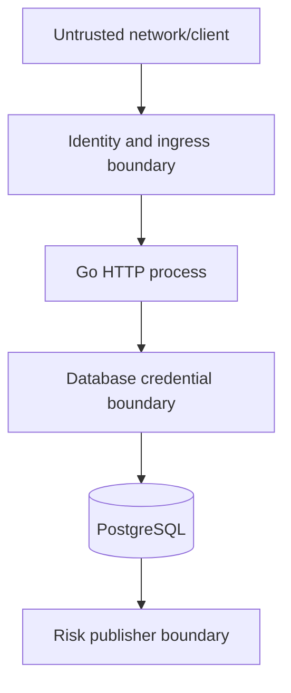

# Threat model

## Scope and method

This model covers the Go service, both repository adapters, the PostgreSQL
schema, the risk outbox and the supplied local deployment. It uses assets,
trust boundaries, abuse cases and STRIDE-style prompts. Controls listed as
current are present in the repository; planned controls are not treated as
implemented.

## Protected assets

- correctness of customer and system account balances;
- completeness, ordering and immutability of journal postings;
- uniqueness and request binding of idempotency records;
- integrity of actor identity and role attributes;
- confidentiality of database credentials and operational configuration;
- completeness and integrity of audit and risk records;
- availability of the write path and database;
- correctness of reconciliation evidence.

## Trust boundaries

The repository supplies only a development identity boundary. Therefore the
safe deployment scope ends before an untrusted network: any caller able to send
requests can forge `X-Principal-ID` and `X-Principal-Role`.

## Threats, controls and residual risk

| Threat | Abuse case | Implemented control | Residual risk / required control |
|---|---|---|---|
| Spoofing | Caller asserts `admin` | Explicit local-only boundary; role validation | Validated OIDC/workload identity, trusted ingress, issuer/audience/expiry checks |
| Horizontal escalation | Customer debits a known foreign account ID | Source-account ownership check in application policy | Centralised policy and tenant scope for a multi-tenant deployment |
| Journal tampering | One side of a transfer is changed or deleted | Atomic repository write, deferred balance constraint, append-only triggers | Separate schema/runtime roles; tamper-evident archival export |
| Balance tampering | Materialised balance differs from journal | Same-transaction update and executable reconciliation | Scheduled monitored reconciliation and incident procedure |
| Replay | Timeout causes a client retry | Mandatory actor-scoped key, unique DB constraint, immutable fingerprint | Tenant scope, retention policy and documented client retry contract |
| Double spend | Concurrent debits observe the same funds | Mutex adapter; serializable PostgreSQL transaction; deterministic row locks; concurrency test | Capacity/load testing and production lock/abort telemetry |
| Repudiation | Actor denies a transfer | Audit row committed atomically with transfer | Authenticated identity, retention policy, external tamper-evident storage |
| Information disclosure | Internal database error reaches caller | Stable public error mapper; request bodies excluded from logs | Formal log-field allowlist, secret scanning and central retention controls |
| Resource exhaustion | Oversized or slow request consumes workers | 1 MiB body limit and HTTP read/write/header/idle timeouts | Rate limits, connection limits, quotas and load shedding at ingress |
| Event loss | Process stops after financial commit | Transactional outbox in PostgreSQL mode; stale-lease recovery | External durable sink, delivery SLO and dead-letter procedure |
| Duplicate event | Worker publishes but cannot mark success | Stable event ID and at-least-once semantics | Consumer-side deduplication by event ID |
| Dependency compromise | Malicious Go or Action dependency | Pinned module versions, `go.sum`, Dependabot, CodeQL, read-only CI permissions | Provenance verification, release signing and dependency review policy |
| Credential misuse | Runtime DB role alters schema or history | Local triggers and container hardening | Distinct least-privilege production roles and secret rotation |

## Detailed abuse cases

### Ambiguous client timeout

The database may commit immediately before the HTTP connection fails. The
caller retries the same request and key. The repository returns the stored
transfer without another balance update. Retrying with a new key is a new
financial command and is outside the idempotency guarantee.

### Idempotency-key substitution

An actor reuses a previous key while changing the amount, account IDs or
description. The service compares the new intent with the immutable stored
intent and returns `idempotency_conflict`. The stored SHA-256 fingerprint is
also recomputed on read to detect internal inconsistency.

### Concurrent overspend

Two transactions try to debit 80 from a balance of 100. Both account pairs are
locked deterministically and PostgreSQL executes them under serializable
isolation. At most one can commit; the other retries against the committed
balance and receives `insufficient_funds`. The integration test asserts final
balances as well as response outcomes.

### Partial financial write

A failure occurs after the source update but before the destination posting.
All writes are inside one database transaction. The transaction rolls back, and
the deferred posting constraint prevents an incomplete journal from committing.

### Outbox worker termination

A worker claims an event and terminates. The row remains `processing`. After the
one-minute lease expires, another worker can claim it. If publication occurred
before termination, the event can be delivered twice; consumers must use its
stable ID for deduplication.

### Direct database mutation

A credential with excessive privilege can update `accounts` or replace
triggers. Reconciliation detects balance drift but cannot establish trustworthy
attribution against a malicious schema owner. Production role separation and
external evidence storage are required.

## Out of scope

- compromise of the operating system, Go runtime or PostgreSQL administrator;
- real sanctions, fraud, AML/KYC or customer-risk decisions;
- cardholder data, card-network processing or PCI DSS scope;
- bank licensing, deposit protection or regulatory reporting;
- multi-region consensus and disaster recovery;
- cryptographic key management and hardware security modules;
- currency exponent and exchange-rate management;
- public blockchain settlement.

## Review triggers

Update this model when a change adds an identity provider, a new money-moving
operation, a different event sink, tenant boundaries, new database privileges,
public network exposure or sensitive personal data.
